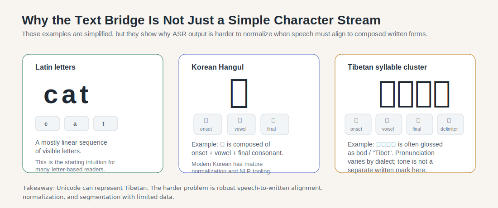
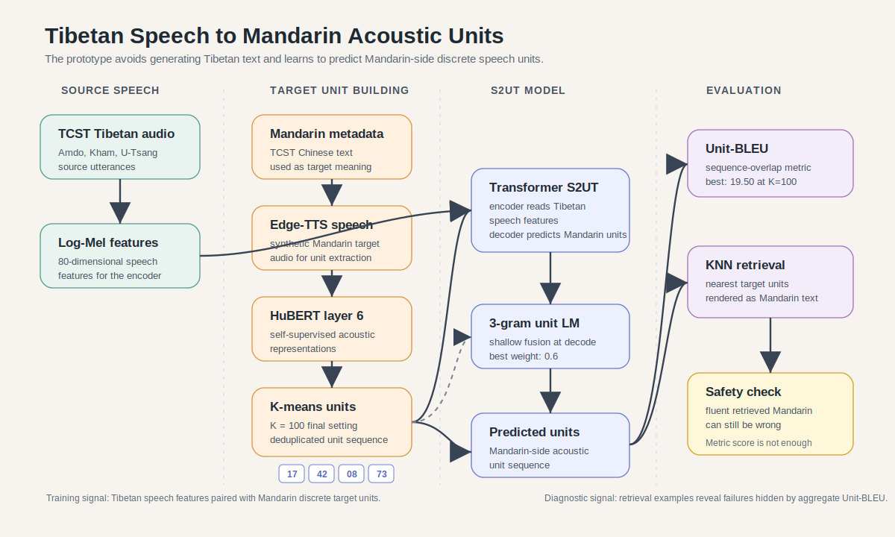

# Tibetan-to-Mandarin Speech-to-Unit Translation Prototype

In this project, I ask a narrow question: can Tibetan source speech be mapped toward Mandarin-side acoustic units without first requiring a complete Tibetan automatic speech recognition system?

The short answer is: partly. The system is a working, inspectable prototype. It builds data, extracts target-side units, trains a Transformer speech-to-unit model, evaluates unit predictions, and runs qualitative retrieval diagnostics. It also fails in important ways: even when the score looks acceptable, the model actually would fail to provide support real users. 

The main technical inspiration is Gong, Xu, and Zhao (2025), *Tibetan-Chinese speech-to-speech translation based on discrete units*: https://www.nature.com/articles/s41598-025-85782-w

## Motivation

Imagine an elderly Tibetan speaker from a remote pastoral area traveling to a large hospital in Chengdu. The hospital staff mostly speaks Mandarin. The patient may be able to describe pain, medication history, or symptoms in Tibetan, but the clinical interaction depends on a Mandarin-speaking system: reception, triage, payment, diagnosis, and follow-up instructions.

This is not just a benchmark problem. It is an access problem. Speech technology can either reduce or intensify the distance between a marginalized speaker and a public service. A translation system in this setting must therefore be evaluated honestly. A fluent Mandarin sentence is not enough if it does not preserve the meaning of the Tibetan speech.

I therefore do not present this as a deployable medical interpreter. It is not a deployable medical interpreter. It is a small intervention that tests one idea: avoiding a fragile Tibetan text bottleneck by predicting Mandarin-side speech units.

## Why the Standard ASR-to-MT-to-TTS Pipeline Is Fragile

A conventional speech translation system usually works as a cascade:

```text
source speech -> ASR text -> machine translation text -> target speech
```

This architecture is attractive because each component can be trained and evaluated separately. But in a low-resource Tibetan-to-Mandarin setting, every stage can become brittle.

First, the pipeline depends on reliable Tibetan ASR. That is difficult when there is  dialectal diversity, limited transcribed speech, and a mismatch between spoken forms and standardized written forms. Errors at the ASR stage then propagate into translation and speech synthesis.

Second, the writing system itself makes the text bridge more complex than a simple character stream. Tibetan is written in syllable units that may combine base letters, prefixes, suffixes, superscribed and subscribed consonants, vowel signs, and syllable delimiters. The practical challenge is not that Unicode cannot represent Tibetan text. It can. Rather, Tibetan text is typically encoded as sequences of letters and combining signs that must be rendered and processed as syllable stacks or grapheme clusters. This differs from modern Korean Hangul, where many commonly used syllable blocks have precomposed Unicode code points and mature normalization support. For Tibetan ASR and downstream NLP, the difficult part is obtaining stable conventions for normalization, tokenization, syllable segmentation, and spoken-to-written alignment. In better-resourced languages, these conventions are often supported by large corpora and mature tools. In this project setting, they are much thinner.

Hangul is also compositional, but modern Korean NLP usually benefits from stronger normalization, segmentation, and data support. Tibetan speech technology has fewer such resources, and the path from acoustic realization to standardized written Tibetan is less supported in practice. This makes an ASR-first cascade a risky dependency.



Third, even if Tibetan ASR were available, a full speech-to-speech system would still need target-side speech generation. Unit-based speech-to-speech translation systems often train a unit vocoder to convert predicted acoustic units into waveforms. That is a separate data and compute burden. For a course project, a smaller prototype is more preferable to an overclaimed full system.

## Core Idea: Translate Speech Into Units, Not Tibetan Text

This project follows the speech-to-unit translation idea: instead of predicting Mandarin characters directly, the model predicts a target-side "acoustic alphabet."

The pipeline uses HuBERT, a self-supervised speech model, to turn Mandarin target speech into frame-level features. K-means clustering then converts those continuous features into discrete unit IDs. A Mandarin utterance becomes a sequence like:

```text
16 24 55 77 45 99 ...
```

These IDs are not words or characters. They are learned acoustic categories. The translation model then learns:

```text
Tibetan speech features -> Mandarin acoustic unit sequence
```

This reframes the task. The source side remains speech. The target side becomes a symbolic sequence that is easier to train than raw waveform generation, but does not require the model to generate Tibetan text.

## Pipeline



The figure shows the main design choice of the project: the model is trained from Tibetan source-speech features to Mandarin acoustic unit sequences, while the target units are built from Mandarin-side synthetic speech and HuBERT features.

The implementation is intentionally smaller than the reference paper. I do not reproduce the full Fairseq-based training recipe, HuBERT fine-tuning, auxiliary ASR/ST/CTC objectives, or a trained unit vocoder, since these components require substantially more engineering time, GPU memory, and speech-generation infrastructure than was available for this prototype; most development and debugging were done on a 16GB MacBook Air, with limited access to larger compute.

Instead, the contribution of this project is a lightweight and inspectable adaptation of the speech-to-unit idea. It keeps the central design choice of avoiding a Tibetan text bottleneck, but replaces the full end-to-end speech-to-speech system with a reproducible pipeline: Mandarin target speech synthesis, HuBERT-based unit extraction, K-means unit inventories, a compact Transformer S2UT model, unit-level LM decoding, K/LM-weight ablations, and retrieval-based qualitative diagnostics. The goal is not to claim parity with the reference paper, but to show what can be built, tested, and critically evaluated under constrained compute.

## Data Construction

This project uses the Tibetan-Chinese Speech Translation corpus (TCST) as the source dataset: https://www.scidb.cn/en/detail?dataSetId=381faff3e8cf4991a0ab2ca669b2444d.

The TCST metadata provides Tibetan source speech and Tibetan/Chinese text fields, but this S2UT prototype needs Mandarin target speech in order to extract target acoustic units. I therefore synthesize Mandarin speech from the Chinese text with Edge-TTS:

```bash
python scripts/01_synthesize_targets.py \
  --json-path TCST/text.json \
  --out-dir data/TCST/wav_zh
```

After preprocessing, the split used in this repo contains:

| Split | Utterances |
|---|---:|
| Train | 5,801 |
| Dev | 725 |
| Test | 726 |

The split is generated with a fixed seed:

```bash
python scripts/03_split_data.py --num-clusters 100
```

## Model

The model maps Tibetan source speech to Mandarin target units.

Source side:

- Tibetan audio is loaded as waveform.
- Audio is converted to mono and resampled to 16 kHz.
- The model uses 80-dimensional log-Mel filterbank features.
- A convolutional subsampler reduces the time dimension by a factor of four.

Target side:

- Mandarin target speech is synthesized from Chinese text.
- HuBERT base layer-6 hidden states are extracted from the Mandarin speech.
- MiniBatch K-means maps frame-level HuBERT features to discrete unit IDs.
- Consecutive duplicate unit IDs are collapsed into reduced unit sequences.
- For K=100, the target vocabulary has 100 unit IDs plus BOS, EOS, and PAD tokens.

The sequence model is a compact Transformer encoder-decoder:

| Component | Setting |
|---|---:|
| Model dimension | 256 |
| Encoder layers | 4 |
| Decoder layers | 4 |
| Attention heads | 4 |
| Feed-forward dimension | 1024 |
| Dropout | 0.1 |
| Optimizer | AdamW |
| Learning rate | 5e-4 |

## Decoding: Why Add a Tiny Unit Language Model?

Low-resource autoregressive decoding is unstable. The model may choose locally plausible but globally poor unit continuations. To regularize the output, I built a count-based 3-gram language model over target-side unit sequences.

During shallow fusion, the next-unit probability is interpolated:

```text
P_fused = (1 - lambda) * P_translation_model + lambda * P_unit_language_model
```

This language model does not know Tibetan or Mandarin words. It only regularizes short-range unit transitions. That is why the LM weight has to be tuned: too little LM guidance may not help, but too much can drown out source-speech conditioning.

## Results

The selected final system uses `K=100`. This matches the reference paper's reported HuBERT-base layer-6, `k=100` unit choice, but the numbers below are not directly comparable to the paper because this repo uses a smaller setup and reports Unit-BLEU over unit sequences.

### K Sweep

| K | Greedy Unit-BLEU | Best LM Unit-BLEU | Best LM weight |
|---|---:|---:|---:|
| 100 | 12.10 | 19.50 | 0.6 |
| 200 | 1.73 | 11.22 | 0.2 |
| 500 | 8.88 | 8.97 | 0.2 |
| 1000 | 4.27 | 5.24 | 0.6 |

Larger K values were not automatically better. In this small model, larger unit vocabularies became sparser and harder to predict. The best balance came from `K=100`.

### LM Weight Ablation for K=100

| LM weight | Unit-BLEU |
|---:|---:|
| 0.0 | 12.10 |
| 0.2 | 13.92 |
| 0.4 | 13.86 |
| 0.6 | 19.50 |
| 0.8 | 1.18 |

The best setting is:

```text
K = 100
LM weight = 0.6
Unit-BLEU = 19.50
```

The shallow-fusion result improves over greedy decoding by `+7.40` Unit-BLEU.


### ## How I Interpret the Score

I treat `19.50` Unit-BLEU as a measurable improvement within this repo, not as evidence of high-quality translation. BLEU-style scores do not have a universal quality threshold, and Unit-BLEU is even harder to interpret because it measures overlap between discrete acoustic unit sequences rather than words or meanings.

A score near `20` suggests that the `K=100` + LM setting has learned more target-unit regularity than the greedy baseline and the larger-K settings tested in this repo. It does not mean that the predicted Mandarin content is semantically correct.

That distinction matters for this project. The quantitative result is useful because it shows that the speech-to-unit pipeline can be trained and improved under limited resources. The qualitative analysis below is equally important because it shows why the same number is not enough for real use. In a medical-access setting, a locally plausible but semantically wrong Mandarin output is still a failure.

## Qualitative Analysis

Unit-BLEU is useful, but it is not semantic evaluation. A unit sequence can overlap with the reference more than another sequence while still failing to preserve meaning. For that reason, the retrieval diagnostics are necessary: they show that the model can obtain the best Unit-BLEU configuration while still mapping a test utterance toward Mandarin content that is semantically unrelated to the Tibetan source.

The diagnostic takes a predicted Mandarin unit sequence, finds the nearest training unit sequence by Levenshtein edit distance, and compares the retrieved Tibetan and Mandarin text. This is deliberately conservative: if the retrieved text is semantically unrelated, the model should not be presented as successful just because it produced a plausible unit sequence.

### K=100 Failure Cases Despite the Best Unit-BLEU

The most important caution is that the strongest aggregate setting, `K=100`, still fails on individual utterances. These examples were generated with the K=100 checkpoint and checked through the KNN retrieval diagnostic. Three of the held-out test examples below produce the same predicted unit length and retrieve the same unrelated training sentence, which suggests that the model can collapse toward a locally plausible unit pattern instead of preserving the source meaning.

| Query sample | Split | Reference Mandarin | Retrieved Mandarin | Pred. unit length | Unit edit distance | Interpretation |
|---|---|---|---|---:|---:|---|
| `maqufa-002` | train | 不断加大高水平对外开放力度， | 今天有人买牙膏吗？ | 67 | 36 | Fluent retrieved Mandarin, but completely wrong meaning. |
| `maqufb-038` | test | 不计算住院次数，采用公共住院全年统计量线。 | 香港特区政府发言人说， | 148 | 97 | A health/administration sentence is mapped to an unrelated political-news phrase. |
| `bodkb-200` | test | 去看电影吗 | 香港特区政府发言人说， | 148 | 97 | A short everyday question is mapped to the same unrelated phrase. |
| `L_F_0_02_235` | test | 加大对三滇藏区的支持力度。 | 香港特区政府发言人说， | 148 | 97 | A public-policy sentence is again mapped to the same unrelated phrase. |

This is the core evaluation lesson. `K=100` gives the best aggregate Unit-BLEU in this repo, but that does not mean the model is usable for the target user. A patient, receptionist, or doctor would not benefit from a system that produces a fluent Mandarin sentence with the wrong content. The failure is not just a decoding inconvenience; it is an access and safety issue.

### Retrieval Diagnostics Across Unit Inventories

The following examples keep the original `maqufa-002` query fixed and vary only the K-means unit inventory. They are not independent held-out test examples; they are diagnostic checks showing how retrieval behavior changes across unit spaces.

| K | Predicted unit length | Retrieved sample | Retrieved Mandarin | Consistent? |
|---:|---:|---|---|---|
| 100 | 67 | `f58-La68_308` | 今天有人买牙膏吗？ | No |
| 200 | 31 | `cuoxiang-191` | 为什么？ | No |
| 500 | 121 | `L_M_0_13_396` | 周永康在青海考察 | No |
| 1000 | 191 | `f71-La16_44` | 在生产发展和社会财富增长的基础上， | No |

This table is not meant to say that K=100 is uniquely bad or that K=1000 is semantically reliable. It shows a broader limitation: nearest-neighbor retrieval over predicted unit sequences can produce fluent, plausible-looking Mandarin while drifting away from the source meaning.

For a fuller qualitative audit workflow, including how to save per-example predictions and sort better/worse held-out cases, see [docs/CASE_ANALYSIS.md](docs/CASE_ANALYSIS.md).

## Reproducing the Main Experiment

Install dependencies:

```bash
conda create -n s2ut python=3.10 -y
conda activate s2ut
python -m pip install --upgrade pip setuptools wheel
python -m pip install -r requirements.txt
```

Check the environment and model:

```bash
python scripts/00_check_env.py
python scripts/04_check_model.py --num-clusters 100
python scripts/05_check_dataset.py --num-clusters 100 --batch-size 2
```

Run one K setting:

```bash
K=100

python scripts/02_extract_units.py \
  --num-clusters "$K" \
  --sample-ratio 0.1 \
  --batch-size 10000 \
  --force-retrain

python scripts/03_split_data.py --num-clusters "$K"
python scripts/05_check_dataset.py --num-clusters "$K" --batch-size 2

python scripts/06_train.py \
  --num-clusters "$K" \
  --batch-size 16 \
  --epochs 40 \
  --learning-rate 5e-4

python scripts/08_evaluate.py \
  --num-clusters "$K" \
  --max-len 600

python scripts/10_ablation_study.py \
  --num-clusters "$K" \
  --max-len 600
```

Run the qualitative retrieval diagnostic:

```bash
python scripts/07_inference.py \
  --num-clusters 100 \
  --test-audio ./TCST/wav/Amdo/maqufa/maqufa_002.wav \
  --max-len 600

python scripts/12_verify_case.py \
  --num-clusters 100 \
  --test-audio ./TCST/wav/Amdo/maqufa/maqufa_002.wav \
  --knn-pool train
```

More reproduction notes are in [docs/EXPERIMENT_GUIDE.md](docs/EXPERIMENT_GUIDE.md).

## What This Project Contributes

I see the contribution in three parts of low-resource NLP and speech work.

Data:

- It constructs Mandarin target speech from TCST Chinese text.
- It creates target-side HuBERT/K-means unit sequences.
- It keeps raw audio and generated artifacts out of GitHub while documenting how to reproduce them.

Learning:

- It trains a compact Transformer S2UT model from Tibetan speech features to Mandarin target units.
- It tests different target unit inventory sizes.
- It adds a small unit-level language model for shallow-fusion decoding.

Evaluation:

- It reports Unit-BLEU rather than claiming semantic translation quality.
- It includes K and LM-weight ablations.
- It uses qualitative retrieval diagnostics to expose semantic failures.

## Limitations

This prototype should not be used for real medical, legal, or public-service interpretation.

Key limitations:

- No human evaluation was run.
- Unit-BLEU is not semantic adequacy.
- The Mandarin target speech is synthesized, not naturally recorded.
- The model does not use fine-tuned HuBERT.
- The model omits auxiliary ASR/ST/CTC objectives used by larger systems.
- The final rendering stage is KNN retrieval plus Edge-TTS, not a trained unit vocoder.
- The retrieval diagnostic shows clear semantic drift.

## Conclusion

The project began from an ethical and technical bottleneck: Tibetan speakers should not have to depend on high-resource Mandarin infrastructure to be understood in public-service settings, yet building reliable Tibetan ASR is itself difficult. A speech-to-unit approach offers a way to test translation without making Tibetan text generation the central dependency.

The results are mixed in a useful way. The K=100 system with LM weight 0.6 reaches `19.50` Unit-BLEU, improving substantially over greedy decoding. At the same time, qualitative retrieval shows that unit overlap and fluent Mandarin rendering do not guarantee meaning preservation.

The takeaway is therefore not "this solves Tibetan-to-Mandarin speech translation." It is: a small discrete-unit prototype can be built and evaluated honestly, and the evaluation shows exactly why low-resource speech translation must be judged by more than fluent output.

## License and Data Use

Code in this repository is released under the MIT License. TCST data and generated artifacts should be used only under their original license terms. If redistribution is not permitted, share scripts and metadata pointers rather than raw audio, generated audio, checkpoints, or K-means binaries.
